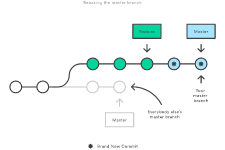

# Git高级技巧

## Merge Vs Rebase

### 假设有如下分支

### 使用Merge将master合并到feature分支

- 优点：
  - 非破坏性操作
  - 现有分支不会以任何方式更改
- 缺点
  - 每次merge都会增加一次commit，如果master非常活跃，这可能会污染您的功能分支的历史
  - 很难理解该项目的git历史记录

### 使用Rebase将master合并到feature分支

- 优点：
  - 获得更清晰的项目历史记录
- 缺点：
  - 不可追溯feature分支最早是从master的哪个节点开辟的
  - 会产生不安全的操作，如果在公共分支（如master）上执行rebase合并其他分支，此时其余人员的master还是旧的，会导致严重的冲突
    