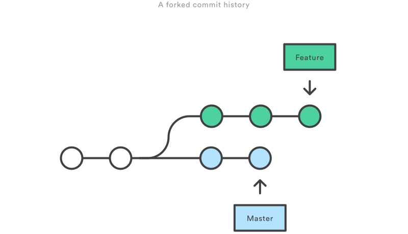
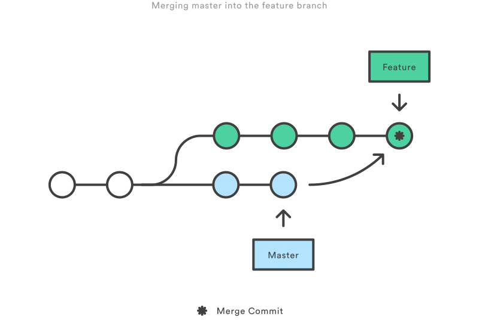

# Git高级技巧

## Merge vs. Rebase

### 假设有如下分支

### 使用Merge将master合并到feature分支

- 优点：
  - 非破坏性操作
  - 现有分支不会以任何方式更改
- 缺点
  - 每次merge都会增加一次commit，如果master非常活跃，这可能会污染您的功能分支的历史
  - 很难理解该项目的git历史记录

### 使用Rebase将master合并到feature分支

- 优点：
  - 获得更清晰的项目历史记录
- 缺点：
  - 不可追溯feature分支最早是从master的哪个节点开辟的
  - 会产生不安全的操作，如果在公共分支（如master）上执行rebase合并其他分支，此时其余人员的master还是旧的，会导致严重的冲突
    

## Reset, Checkout, Revert

- checkout主要用于切换分支
- checkout，reset通常用于进行本地或私有撤消。它们修改了存储库的历史记录，当推送到远程共享存储库时可能会导致冲突。
- revert操作被认为是“公共撤消”操作的安全操作，因为它创建了可以远程共享的新历史记录。

### checkout

### reset

## revert

